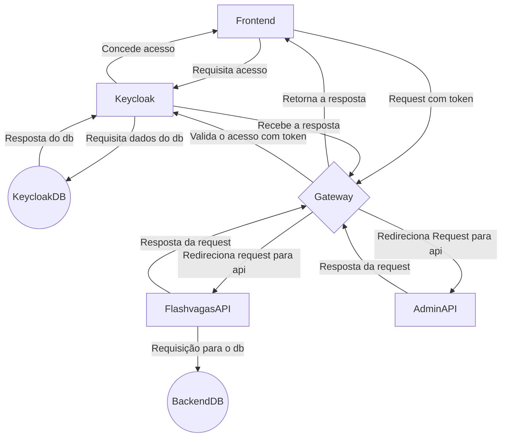
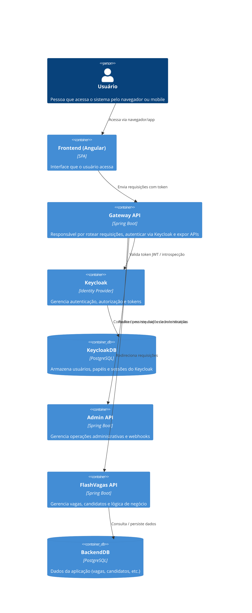

# FlashVagas - Arquitetura do Sistema

## Visão Geral

O FlashVagas é uma plataforma de busca e notificação de vagas de emprego que utiliza uma arquitetura de microsserviços com múltiplas APIs, frontend Angular e infraestrutura containerizada.

## Arquitetura Geral

### Representação da arquitetura

#### Diagrama de fluxo


#### Diagrama de containers


## Componentes do Sistema

### 1. Frontend (Angular 19)
- **Tecnologia**: Angular 19.2.0
- **Localização**: `/frontend/`
- **Funcionalidades**:
  - Interface de usuário responsiva
  - Autenticação via Keycloak
  - Dashboard de vagas
  - Configurações de preferências
  - Sistema de assinaturas/planos
- **Dependências Principais**:
  - `@angular/material`: Componentes UI
  - `keycloak-angular`: Integração com Keycloak
  - `rxjs`: Programação reativa

### 2. Gateway API (Spring Cloud Gateway)
- **Tecnologia**: Spring Boot 3.4.5 + Spring Cloud Gateway
- **Localização**: `/gateway-api/`
- **Porta**: 9000
- **Responsabilidades**:
  - Roteamento de requisições
  - Circuit breaker (Resilience4j)
  - Autenticação OAuth2
  - CORS configuration
- **Configurações**:
  - Roteamento para FlashVagas API (`/api/v1/**`)
  - Fallback para serviços indisponíveis
  - Swagger aggregation (`/aggregate/flashvagas-api/v3/api-docs`)
  - Recursos livres: Swagger UI, Actuator, API docs

### 3. FlashVagas API (API Principal)
- **Tecnologia**: Spring Boot 3.5.0
- **Localização**: `/flashvagas-api/`
- **Porta**: 8080 (interno) / 8083 (externo)
- **Responsabilidades**:
  - Gerenciamento de vagas
  - Preferências de usuário
  - Integração com serviços externos
  - Processamento de mensagens (RabbitMQ)
- **Dependências Principais**:
  - Spring Data JPA
  - Spring AMQP (RabbitMQ)
  - Flyway (Migrations)
  - PostgreSQL
  - TestContainers

### 4. Admin API
- **Tecnologia**: Spring Boot 3.5.0
- **Localização**: `/admin-api/`
- **Porta**: 8081
- **Responsabilidades**:
  - Agendamento de tarefas (`@EnableScheduling`)
  - Envio de mensagens (Twilio)
  - Processamento de pagamentos (Stripe)
  - Webhooks
  - Schedulers para envio de mensagens por plano
- **Dependências Principais**:
  - Stripe Java SDK
  - Twilio SDK
  - Spring Scheduling
- **Agendamentos**:
  - Essentials: 9h e 18h diariamente
  - Turbo: 7h, 12h, 16h e 20h diariamente

### 5. Infraestrutura

#### Banco de Dados
- **PostgreSQL 17**: Banco principal
- **Flyway**: Migrations automáticas
- **Tabelas Principais**:
  - `user_preferences`: Preferências de busca (FlashVagas)
  - `user_preferences_jsearch`: Preferências específicas JSearch
  - `jobs_user`: Relacionamento vagas-usuário
  - `products`: Produtos/planos de assinatura (Essentials: R$9,90, Turbo: R$14,90)
- **Validações**:
  - Função customizada para validar employment types
  - Constraints para tipos de contrato e busca

#### Autenticação e Autorização
- **Keycloak 26.1**: Servidor de identidade
- **Realm**: Configuração personalizada
- **Integração**: OAuth2/OIDC com Angular e APIs

#### Mensageria
- **RabbitMQ**: Broker de mensagens
- **Versão**: 3-management (prod) / 4.0-management (dev)
- **Uso**: Comunicação assíncrona entre serviços
- **Interface**: Management UI disponível em ambas as versões

#### Email (Desenvolvimento)
- **MailHog**: Servidor SMTP para desenvolvimento
- **Interface**: Web UI para visualização de emails

## Padrões Arquiteturais

### 1. Arquitetura de Microsserviços
- Separação clara de responsabilidades
- APIs independentes e escaláveis
- Comunicação via HTTP/REST

### 2. API Gateway Pattern
- Ponto único de entrada
- Roteamento inteligente
- Circuit breaker para resiliência

### 3. Event-Driven Architecture
- RabbitMQ para comunicação assíncrona
- Processamento de eventos em background

### 4. Domain-Driven Design (DDD)
- Estrutura de pacotes por domínio
- Entidades e value objects bem definidos
- Separação de camadas (API, Application, Domain, Infrastructure)

## Estrutura de Domínio

### FlashVagas API
```
domain/
├── entity/
│   ├── job/           # Entidades relacionadas a vagas
│   ├── user/          # Entidades de usuário
│   ├── user_preferences/ # Preferências de busca
│   └── products/      # Produtos/planos
├── value_object/      # Objetos de valor (Country, Employer, etc.)
application/
├── service/           # Serviços de aplicação
├── mapper/           # Mapeadores
infrastructure/
├── repository/       # Repositórios
├── integrations/     # Integrações externas
└── consumers/        # Consumidores de mensagens
```

### Admin API
```
application/
├── service/          # Serviços de aplicação
│   ├── keycloak/     # Integração Keycloak
│   ├── plan_message/ # Serviços de mensagens
│   ├── send_message/ # Envio de mensagens
│   └── webhook/      # Webhooks
├── scheduler/        # Agendadores
└── mapper/          # Mapeadores
```

## Configurações de Ambiente

### Desenvolvimento
- **Docker Compose**: `docker-compose.dev.yml`
- **Portas expostas**: Todas as portas mapeadas
- **Volumes**: Dados persistentes em `./data/`
- **MailHog**: Para captura de emails

### Produção
- **Docker Compose**: `docker-compose.prod.yml`
- **SSL/TLS**: Certbot para certificados Let's Encrypt
- **Restart Policy**: `unless-stopped`
- **Nginx**: Proxy reverso no frontend
- **Domínios**: 
  - `flashvagas.com.br` (principal)
  - `auth.flashvagas.com.br` (Keycloak)
- **Portas**: 80 (HTTP), 443 (HTTPS)

## Fluxo de Dados

### 1. Autenticação
```
Usuário → Frontend → Keycloak → Gateway API → APIs Internas
```

### 2. Busca de Vagas
```
Frontend → Gateway API → FlashVagas API → Integrações Externas
```

### 3. Notificações
```
Admin API → Scheduler → PlanMessageService → Twilio → Usuários
```

### 4. Pagamentos
```
Frontend → Gateway API → Admin API → Stripe
```

## Monitoramento e Observabilidade

### Health Checks
- **Actuator**: Endpoints de saúde em todas as APIs
- **Circuit Breaker**: Resilience4j no Gateway

### Logs
- **Estruturados**: Logs JSON
- **Centralizados**: Via Docker logs

### Métricas
- **Spring Boot Actuator**: Métricas básicas
- **Prometheus**: Preparado para métricas customizadas

## Segurança

### Autenticação
- **OAuth2/OIDC**: Via Keycloak
- **JWT Tokens**: Para APIs
- **Silent SSO**: No frontend

### Autorização
- **Roles**: Definidas no Keycloak
- **Guards**: No frontend Angular
- **Security Config**: No Gateway

### Comunicação
- **HTTPS**: Em produção com Let's Encrypt
- **CORS**: Configurado no Gateway (localhost:4200)
- **Headers**: Authorization, Content-Type permitidos

## Deploy e CI/CD

### Build Scripts
- `build-and-push-tags.sh`: Build com tags
- `build-and-push.prod.sh`: Build para produção

### Containers
- **Multi-stage builds**: Otimização de imagens
- **Health checks**: Verificação de saúde
- **Environment variables**: Configuração por ambiente

## Considerações de Performance

### Frontend
- **Lazy Loading**: Módulos carregados sob demanda
- **Tree Shaking**: Otimização de bundle
- **Environment Generation**: Script para gerar environment.ts
- **Build Optimization**: Configurações específicas para dev/prod

### Backend
- **Connection Pooling**: PostgreSQL
- **Caching**: Preparado para Redis
- **Async Processing**: RabbitMQ para tarefas pesadas
- **Scheduled Tasks**: Cron jobs para envio de mensagens

### Infraestrutura
- **Load Balancing**: Via Gateway
- **Circuit Breaker**: Proteção contra falhas
- **Resource Limits**: Docker resource constraints

## Correções e Atualizações da Documentação

### Correções Identificadas:
1. **Gateway API**: Removido "Rate Limiting" (não implementado), adicionado CORS configuration
2. **Admin API**: Adicionados detalhes dos schedulers e horários de envio de mensagens
3. **Banco de Dados**: Adicionados preços dos planos e validações customizadas
4. **Produção**: Adicionados domínios específicos e configuração SSL detalhada
5. **Fluxo de Notificações**: Corrigido para refletir o uso direto do Twilio
6. **Frontend**: Adicionada informação sobre geração de environment.ts

### Dados Verificados:
- ✅ Versões das tecnologias confirmadas
- ✅ Portas e configurações de rede corretas
- ✅ Estrutura de banco de dados validada
- ✅ Configurações de segurança verificadas
- ✅ Agendamentos e cron jobs confirmados

## Roadmap Técnico

### Curto Prazo
- [ ] Implementar cache Redis
- [ ] Adicionar métricas Prometheus
- [ ] Melhorar logging estruturado
- [ ] Implementar rate limiting no Gateway
- [ ] Adicionar health checks customizados

### Médio Prazo
- [ ] Implementar feature flags
- [ ] Adicionar testes de integração
- [ ] Implementar blue-green deployment
- [ ] Configurar monitoramento de agendadores
- [ ] Implementar retry policies para mensagens

### Longo Prazo
- [ ] Migração para Kubernetes
- [ ] Implementar service mesh
- [ ] Adicionar observabilidade distribuída
- [ ] Implementar multi-tenancy
- [ ] Adicionar suporte a múltiplos provedores de vagas
