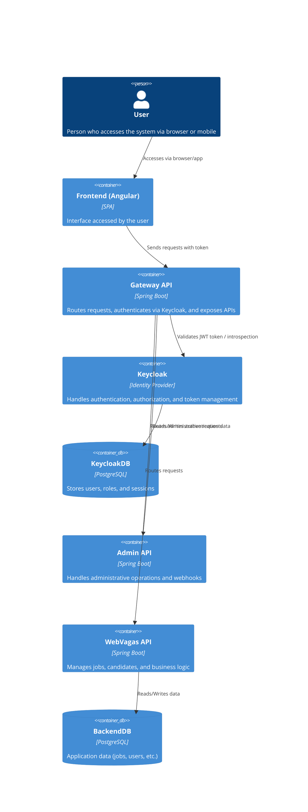

# WebVagas - System Architecture {#top}

## Summary
- [Overview](#overview)
- [General architecture](#general-architecture)
  - [Architecture representation](#arquitecture-representation)
    - [Flux diagram](#flux-diagram)
    - [Use cases diagram](#use-cases-diagram)
    - [Containers-diagram](#containers-diagram)
- [System components](#system-components)
  - [Frontend](#frontend)
  - [Gateway](#gateway)
  - [Webvagas API](#webvagas-api)
  - [UrlShortener API](#urlshortener-api)
- [Infrastructure](#infrastructure)
  - [Databases](#databases)
  - [Authentication and Authorization](#authorization-and-authentication)
  - [Brokers](#brokers)
  - [Email service](#email-service)
- [Architectural patterns](#arquitectural-patterns)
  - [Microservices architecture](#microservices-architecture)
  - [API Gateway Pattern](#gateway-pattern)
  - [Event-Driven Architecture](#event-driven)
  - [Domain-Driven Design](#ddd)
- [Folders structure](#folders-structure)
  - [WebVagas API](#folders-webvagas-api)
  - [Gateway API](#folders-gateway-api)
  - [Urlshortener API](#folders-urlshortener-api)
  - [Admin API](#folders-admin-api)
- [Environment configurations](#environment-configurations)
  - [Development](#environment-development)
  - [Production](#environment-production)
- [Data flux](#data-flux)
  - [Authentication](#flux-authentication)
  - [Jobs search](#flux-jobsearch)
  - [Notification](#flux-notification)
  - [Payment](#flux-payment)
- [Monitoring and observability](#monitoring-and-observability)
  - [Health Checks](#health-checks)
  - [Logs](#logs)
  - [Metrics](#metrics)
- [Security](#security)
  - [Authentication](#authentication)
  - [Authorization](#authorization)
  - [Comunication](#communication)
- [Deploy and CI/CD](#ci-cd)
  - [Build Scripts](#build-scripts)
  - [Containers](#build-containers)
- [Performance considerations](#performance-considerations)
  - [Frontend](#frontend-performance)
  - [Backend](#backend-performance)
  - [Infrastructure](#infrastructure-performance)

## Overview {#overview}

**WebVagas** is a job search and notification platform that uses a microservices architecture with multiple APIs, an Angular frontend, and containerized infrastructure.

## General architecture {#general-architecture}

### Architecture representation {#arquitecture-representation}

#### Flux diagram {#flux-diagram}
<div style="overflow: auto;">
  <pre class="mermaid">
    flowchart LR
      subgraph Auth[Authentication]
        B[Keycloak]
        C[Keycloak Database]
      end

      subgraph Gateway
        E[API Gateway]
      end

      subgraph APIs
        D[Webvagas API]
        G[Admin API]
        H[UrlShortener API]
      end

      subgraph Databases
        F[WebVagasApi Database]
        I[UrlShortenerApi Database]
      end

      A[Frontend] -->|Requests access|B
      B[Keycloak] -->|Grants access|A
      B -->|Queries data|C((KeycloakDB))
      C -->|DB Response|B
      A -->|Request with token|E{Gateway}
      E -->|Returns response|A
      E -->|Validates token|B
      B -->|Returns validation result|E
      E -->|Routes request to|D[WebvagasAPI]
      D -->|Returns response|E
      D -->|Queries database|F((WebVagasApiDB))
      F -->|DB Response|D
      E -->|Routes request to|G[AdminAPI]
      G -->|Returns response|E
      E -->|Routes request to|H[UrlShortenerAPI]
      H -->|Returns response|E
      H -->|Queries database|I((UrlShortenerApi))
      I -->|DB Response|H
  </pre>
</div>

<div style="display: flex;flex-direction: column"> <a style="text-align: right;" href="#top">Back to top</a> </div>

#### Use cases diagram {#use-cases-diagram}

> To access the use case diagram [click here](https://github.com/MarcoAntunes37/web-vagas/blob/main/doc/casos-de-uso.md)

<div style="display: flex;flex-direction: column"> <a style="text-align: right;" href="#top">Back to top</a> </div>

#### Containers diagram {#containers-diagram}


<div style="display: flex;flex-direction: column"> <a style="text-align: right;" href="#top">Back to top</a> </div>

## System components {#system-components}

### Frontend (Angular 19) {#frontend}
- **Technology**: Angular 19.2.0
- **Path**: `/frontend/`
- **Funcionalidades**:
  - Responsive user interface
  - Authentication and authorization via Keycloak
  - Preferences configuration
  - Fully functional subscribe system
- **Key dependencies**:
  - `@angular/material`: Components UI
  - `keycloak-angular`: Keycloak angular integration
  - `rxjs`: Reactive programming

<div style="display: flex;flex-direction: column"> <a style="text-align: right;" href="#top">Back to top</a> </div>

### Gateway API (Spring Cloud Gateway) {#gateway}
- **Technology**: Spring Boot 3.4.5 + Spring Cloud Gateway
- **Path**: `/gateway-api/`
- **Port**: 9000
- **Responsabilities**:
  - Request router
  - Circuit breaker (Resilience4j)
  - OAuth2
  - CORS
- **Configuration**:
  - Routing to WebVagas API (`/api/v1/<webvagas-routes>`)
  - Routing to Admin API (`/api/v1/<admin-routes>`)
  - Service unnavailable fallback route
  - Swagger aggregation (`/aggregate/webvagas-api/v3/api-docs`)
  - Free ressources: Swagger UI, Actuator and API docs
  Obs.: In this layer swagger calls will hit gateway endpoints that is secured cause 501 by acessing without a valid token. That means swagger will work more like a readonly documentation in this layer.

<div style="display: flex;flex-direction: column"> <a style="text-align: right;" href="#top">Back to top</a> </div>

### WebVagas API (UserPreferences and JobsUser services) {#webvagas-api} 
- **Technology**: Spring Boot 3.5.0
- **Path**: `/webvagas-api/`
- **Port**: 8080 (intern) / 8083 (extern)
- **Responsabilities**:
  - User preferences management
  - Veryfiy already sended jobs
  - Integration with extern services
- **Key dependencies**:
  - Spring Data JPA
  - Spring AMQP (RabbitMQ)
  - Flyway (Migrations)
  - PostgreSQL
  - TestContainers

<div style="display: flex;flex-direction: column"> <a style="text-align: right;" href="#top">Back to top</a> </div>

### Admin API (Integration heavy, Data process heavy) {#admin-api}
- **Technology**: Spring Boot 3.5.0
- **Path**: `/admin-api/`
- **Port**: 8081
- **Responsabilities**:
  - Task scheduling
  - Message sending (Twilio)
  - Payment processing (Stripe)
  - Integration with webvagas-api (UserPreferences and JobsUser)
  - Webhook who listen stripe events and treat accordly
  - Schedulers to send subscriptions message
- **Key dependencies**:
  - Stripe Java SDK
  - Twilio SDK
- **Scheduling**:
  - Essentials: 9h and 18h daily
  - Turbo: 7h, 12h, 16h and 20h daily

<div style="display: flex;flex-direction: column"> <a style="text-align: right;" href="#top">Back to top</a> </div>

### UrlShortener API {#urlshortener-api}
- **Technology**: Spring Boot 3.5.0
- **Path**: `/urlshortener-api/`
- **Port**: 8082
- **Responsabilities**:
  - Temporarelly store a url and return an shortened url who is a reference to original url
  - Redirect to origin url on short url access
- **Motivations**
  - External tools would be costlier for temporary storage
  - Job URLs are short-lived and don’t need long-term retention
  - A cleanup job is manually required post-database creation

<div style="display: flex;flex-direction: column"> <a style="text-align: right;" href="#top">Back to top</a> </div>

## Infrastructure {#infrastructure}

### Databases {#databases}
1. Webvagas database
- **Database name**: webvagas
- **Database vendor**: PostgreSQL 17
- **Flyway**: Automátic migrations
- **Tabelas Principais**:
  - `user_preferences`: User preferences to job search
  - `jobs_user`: Jobs already sended per user
- **Validações**:
  - Validation of employment types via constraints

2. UrlShortener database
- **Database name**: urlshortener
- **Database vendor**: PostgreSQL 17
- **Flyway**: Automátic migrations
- **Tabelas Principais**:
  - `short_url`: Url shortener

<div style="display: flex;flex-direction: column"> <a style="text-align: right;" href="#top">Back to top</a> </div>

### Authentication and Authorization {#authorization-and-authentication}
- **Keycloak 26.1**: Identity server
- **Realm**: Personalised configuration
- **Integração**: OAuth2/OIDC with Angular and APIs

<div style="display: flex;flex-direction: column"> <a style="text-align: right;" href="#top">Back to top</a> </div>

### Brokers {#brokers}
- **Message Broker**: RabbitMQ 
- **Versão**: 4.0-management (prod) / 4.0-management (dev)
- **Uso**: Async communication between services
- **Interface**: Management UI

<div style="display: flex;flex-direction: column"> <a style="text-align: right;" href="#top">Back to top</a> </div>

### Email service (Development mode) {#email-service}
- **MailHog**: Mock smtp
- **Interface**: Use mailhog interface to visualise emails sended

<div style="display: flex;flex-direction: column"> <a style="text-align: right;" href="#top">Back to top</a> </div>

## Architectural patterns {#arquitectural-patterns}

### Microservices architecture {#microservices-architecture}
- Clear responsability segregations
- Independent scalable apis
- Communication with HTTP/REST

<div style="display: flex;flex-direction: column"> <a style="text-align: right;" href="#top">Back to top</a> </div>

### API Gateway Pattern {#gateway-pattern}
- Single access point
- Smart routing
- Resilience with circuit breaking

<div style="display: flex;flex-direction: column"> <a style="text-align: right;" href="#top">Back to top</a> </div>

### Event-Driven Architecture {#event-driven}
- Async communication with rabbitmq

<div style="display: flex;flex-direction: column"> <a style="text-align: right;" href="#top">Back to top</a> </div>

### Domain-Driven Design (DDD) {#ddd}
- Packages structure
- Clear and rich domain entities and value objects
- Entities access delegation to complex objects properties
- Split layers (API, Application, Domain, Infrastructure e Persistence)

<div style="display: flex;flex-direction: column"> <a style="text-align: right;" href="#top">Back to top</a> </div>

## Folders structure {#folders-structure}

### WebVagas API {#folders-webvagas-api}
```
api/
├──config/             # Open api and object mapper configuration
├──controller/
│    ├──checkout_session
│    ├──customer_portal
│    ├──jobs_user
│    └──user_preferences
application/
├──mapper/             # mappers between layers
│    ├──checkout_session
│    ├──customer_portal
│    ├──jobs_user
│    └──user_preferences
├──service/             # Services
│    ├──checkout_session
│    ├──customer_portal
│    ├──jobs_user
│    └──user_preferences
domain/                 # Domain
├── entity/
│    ├──checkout_session
│    ├──customer_portal
│    ├──jobs_user
│    └──user_preferences
├── value_object/      # Value objects
infrastructure/
├── config/           # Configurations rabbitmq
│   └──RabbitMQ
│        └──enums
├── repository/       # Repository
│    ├──jobs_user
│    └──user_preferences
├── integrations/     # Third party integrations
│    └──stripe     
├── consumers/        # Rabbitmq consumers
persistence/
│    ├──jobs_user
│    └──user_preferences
```

<div style="display: flex;flex-direction: column"> <a style="text-align: right;" href="#top">Back to top</a> </div>

### Gateway API {#folder-gateway-api}
configs/            # Security config
routes/             # Router config

<div style="display: flex;flex-direction: column"> <a style="text-align: right;" href="#top">Back to top</a> </div>

### UrlShortener API {#folder-urlshortener-api}
```
api/
├──config/             # Open api and object mapper configuration
├──controller/         # Controllers
application/
├──mapper/             # mappers
│    └──url_shortener
├──service/             # Services
│    └──url_shortener
domain/                 # Domain
├── entity/
│    └──url_shortener
├── value_object/      # Value objects
infrastructure/
├── entity/           
├── repository/       # Repository
│    └──projections   # Database projections (Dynamic tables)
persistence/
│    └──short_url     # Database entity
```

<div style="display: flex;flex-direction: column"> <a style="text-align: right;" href="#top">Back to top</a> </div>

### Admin API {#folders-admin-api}
```
api/
├──config/             # Open api configuration
├──controller/
│    ├──send_message
│    └──webhook
application/
├── abstraction/
│   └──base_message   # Send message abstraction
├── service/          
│   ├── keycloak/     # Keycloak integrations service
│   ├── plan_message/ # Message service by subscription
│   ├── send_message/ # Message sender service
│   └── webhook/      # Stripe webhook service
├── scheduler/
│   └──send_message   # Scheduled process to send messages by subscriptions    
│── mapper/           # Mappers
domain/
│── entity            # Domain entities
│── value_object      # Value objects
infrastructure/
│── config            # Configurations
│── integration
│   ├──jsearch        # Integration client Jsearch API
│   ├──keycloak       # Integration client Keycloak Admin API
│   ├──stripe         # Integration client Stripe API
│   ├──urlshortener   # Integration client UrlShortener API
│   └──webvagas       # Integration client Webvagas API
```

<div style="display: flex;flex-direction: column"> <a style="text-align: right;" href="#top">Back to top</a> </div>

## Environment configurations {#environment-configurations}

### Development {#environment-development}
- **Docker Compose**: `docker-compose.dev.yml`
- **Exposed ports**: All ports mapped
- **Volumes**: Volumes located in `./data/`
- **MailHog**: Email service simulation

<div style="display: flex;flex-direction: column"> <a style="text-align: right;" href="#top">Back to top</a> </div>

### Production {#environment-production}
- **Docker Compose**: `docker-compose.prod.yml`
- **SSL/TLS**: cloudflare-tunnel
- **Restart Policy**: `unless-stopped`
- **Nginx**: Frontend reverse proxy
- **Domain**: 
  - `app.webvagas.com.br` (Application)
  - `auth.webvagas.com.br` (Keycloak)
- **Ports**: 80 (HTTP), 443 (HTTPS)

<div style="display: flex;flex-direction: column"> <a style="text-align: right;" href="#top">Back to top</a> </div>

## Data flux {#data-flux}

### Authentication {#flux-authentication}
```
User → Frontend → Keycloak → Gateway API → Intern APIs
```

<div style="display: flex;flex-direction: column"> <a style="text-align: right;" href="#top">Back to top</a> </div>

### Jobs search {#flux-jobsearch}
```
Frontend → Gateway API → WebVagas API → Jsearch integration → Jsearch API
```

<div style="display: flex;flex-direction: column"> <a style="text-align: right;" href="#top">Back to top</a> </div>

### Notification {#flux-notification}
```
Admin API → Scheduler → PlanMessageService → Twilio → Users
```
<div style="display: flex;flex-direction: column"> <a style="text-align: right;" href="#top">Back to top</a> </div>

### Payment {#flux-payment}
```
Frontend → Gateway API → Admin API → Stripe
```

<div style="display: flex;flex-direction: column"> <a style="text-align: right;" href="#top">Back to top</a> </div>

## Monitoring and observability {#monitoring-and-observability}

### Health Checks {#health-checks}
- **Actuator**: Health endpoints in all APIs
- **Circuit Breaker**: Gateway circuit breaker with Resilience4j

<div style="display: flex;flex-direction: column"> <a style="text-align: right;" href="#top">Back to top</a> </div>

### Logs {#logs}
- **Structured**: Logs JSON
- **Centered**: Docker logs

<div style="display: flex;flex-direction: column"> <a style="text-align: right;" href="#top">Back to top</a> </div>

### Metrics {#metrics}
- **Spring Boot Actuator**: Basic metrics

<div style="display: flex;flex-direction: column"> <a style="text-align: right;" href="#top">Back to top</a> </div>

## Security {#security}

### Authentication {#authentication}
- **OAuth2/OIDC**: Keycloak
- **JWT Tokens**: for APIs
- **Silent SSO**: in Frontend

<div style="display: flex;flex-direction: column"> <a style="text-align: right;" href="#top">Back to top</a> </div>

### Authorization {#authorization}
- **Roles**: Keycloak defined roles
- **Guards**: in Frontend Angular
- **Security Config**: in Gateway

<div style="display: flex;flex-direction: column"> <a style="text-align: right;" href="#top">Back to top</a> </div>

### Comunication {#communication}
- **HTTPS**: Production mode cloud flare generate a ssl certificate
- **CORS**: Configured in Gateway (localhost:4200)
- **Headers**: Authorization, Content-Type are permited

<div style="display: flex;flex-direction: column"> <a style="text-align: right;" href="#top">Back to top</a> </div>

## Deploy and CI/CD{#ci-cd}

### Build Scripts {#build-scripts}
- `build-and-push-tags.sh`: Build with tags for alocate in one only repository
- `build-and-push.prod.sh`: Build for production

<div style="display: flex;flex-direction: column"> <a style="text-align: right;" href="#top">Back to top</a> </div>

### Containers {#build-containers}
- **Multi-staged builds**: Image optimization by splitting only necessary from build to run 
- **Health checks**: Health checks
- **Environment variables**: Configuration based in environment

<div style="display: flex;flex-direction: column"> <a style="text-align: right;" href="#top">Back to top</a> </div>

## Performance considerations {#performance-considerations}

### Frontend {#frontend-performance}
- **Lazy Loading**: Load modules on demand
- **Tree Shaking**: Bundle optimization
- **Environment Generation**: Environment.ts generate dinamically based on environment

<div style="display: flex;flex-direction: column"> <a style="text-align: right;" href="#top">Back to top</a> </div>

### Backend {#backend-performance}
- **Connection Pooling**: PostgreSQL
- **Async Processing**: RabbitMQ is used to reflect keycloak user delete into other services where userid has weak relationship
- **Scheduled Tasks**: Cron jobs

<div style="display: flex;flex-direction: column"> <a style="text-align: right;" href="#top">Back to top</a> </div>

### Infrastructure {#infrastructure-performance}
- **Load Balancing**: from Gateway
- **Resource Limits**: Docker resource constraints

<div style="display: flex;flex-direction: column"> <a style="text-align: right;" href="#top">Back to top</a> </div>